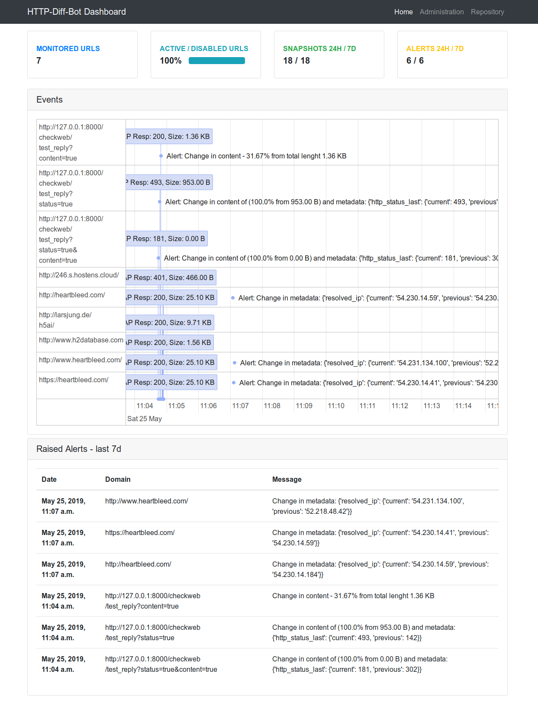

# HTTP-Diff-Bot

HTTP-Diff-Bot is Django powered application to compare and alert on changes of HTTP and HTML responses.
Insert URL or Domain and receive email every time a change is observed.

Features:

	- Alert on change of HTTP status code (200 -> 404)
	- Alert on change of HTML content within defined thresholds
	- Show side-by-side comparison of HTML changes between last snapshots
	- Show dashboard with taken snapshots and raised alerts

Screenshot - front-end dashboard


### Prerequisites

- OS: Linux (referred), OS X or Windows
- Python >= 3.6
- Apache/Nginx  (Production Deployment Only)

### Installing

- Install system packages

	`sudo apt install git apache2 libapache2-mod-wsgi-py3 virtualenv sqlite3 tor `

- Install Ruby Diff library

	`sudo gem install diff-lcs`

- Get package

	`git clone git@github.com:petermat/HTTP-Diff-Bot.git`

- Configure Python Virtual environment
	```
	virtualenv -p python3.6 venv
	source venv/bin/activate
	cd HTTP-Diff-Bot
	pip install -r requirements.txt
	```

## Production Deployment - skip if running in debug local server mode

- Always generate new SECRET_KEY!

	Run command:

	`python manage.py shell -c 'from django.core.management import utils; print(utils.get_random_secret_key())'`

	and replace SECRET_KEY value in `project/settings.py`.


- Reverse Apache proxy for production environment. Configure `/etc/apace2/site-available/000-default.conf`:

	```
	WSGIScriptAlias / /home/user/HTTP-Diff-Bot/project/wsgi.py
	WSGIDaemonProcess servername python-home=/home/user/venv python-path=/home/user/HTTP-Diff-Bot
	WSGIProcessGroup servername

	<Directory /home/user/HTTP-Diff-Bot/project/project/>
		<Files wsgi.py>
			Order deny,allow
			Allow from all
		</Files>
	</Directory>

	<Directory /home/user/HTTP-Diff-Bot/project/ >
		Options Indexes FollowSymLinks
		Require all granted
	</Directory>
	```

- Add user to www-data group

	`sudo usermod -a -G www-data myuser`

- Collect static files for Web Server

	`python manage.py collectstatic`

- add CRON entry for scheduled run

	`* */6 * * * /home/myuser/venv/bin/python /home/myuser/manage.py runner`


## Getting Started

Rename file `project/local.RENAME.py` to `local.py` and edit `ALLOWED_HOSTS` and SMTP settings

Initial database structure

	`python manage.py makemigrations checkweb`
	`python manage.py migrate`

Create system Superuser

	`python manage.py create superuser`

To fill project with test data run following:

	`python manage.py hopper`

Application is now ready to run - try local debug mode

	`python manage.py runserver`

## Running the tests

Tests not implemented yet.


## License

This project is licensed under the MIT License - see the [LICENSE.md](LICENSE.md) file for details
